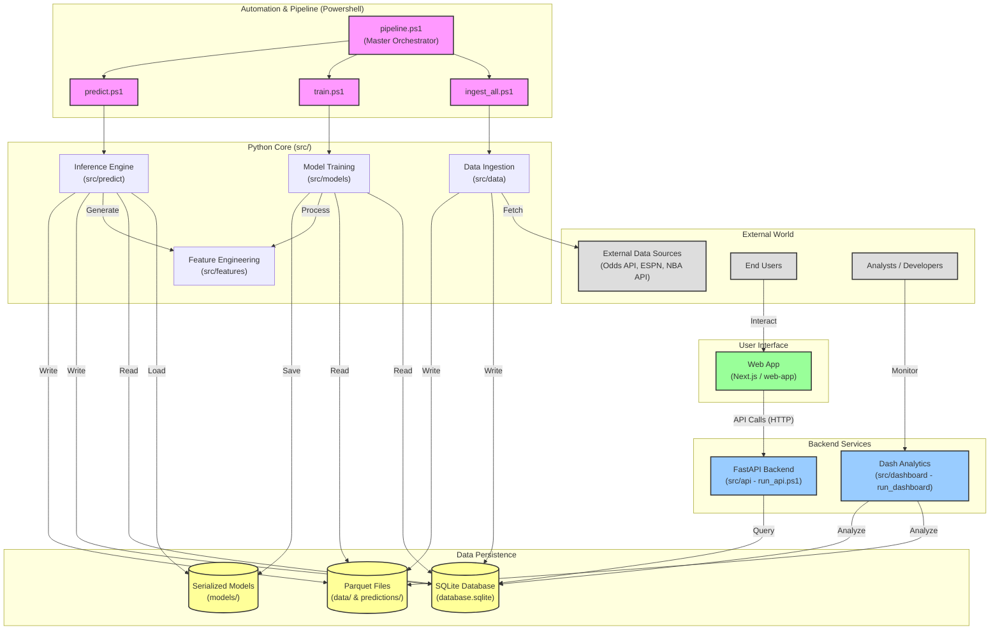

# System Architecture

This document provides a high-level overview of the system architecture, including data ingestion, machine learning pipeline, and user interfaces.

## Component Overview

### 1. Automation & Pipeline
The system is orchestrated by PowerShell scripts located in the `scripts/` directory.
- **pipeline.ps1**: The master entry point that coordinates ingestion, training, and prediction.
- **ingest_all.ps1**: Handles data fetching from external sports APIs.
- **train.ps1**: Retrains machine learning models (LightGBM, XGBoost).
- **predict.ps1**: Runs the inference engine to generate betting probabilities.

### 2. Core Logic (`src/`)
- **src/data**: Connectors for data sources (NFL, NBA, etc.).
- **src/features**: Logic for transforming raw stats into model features (rolling averages, differentials).
- **src/models**: Configuration and training logic for ML models.
- **src/predict**: The runtime engine that applies models to upcoming games.

### 3. Data Storage
- **database.sqlite**: Stores structured relational data (game schedules, odds, team info).
- **Parquet Files**: Stores large tabular datasets, including historical features (`data/`) and model predictions (`data/forward_test`), for efficient reading.

### 4. Serving & Frontend
- **FastAPI**: A lightweight Python API server (`run_api.ps1`) that exposes prediction data to the frontend.
- **Dash**: An internal analytics dashboard (`run_dashboard`) for visualizing model performance and backtesting results.
- **Next.js Web App**: The user-facing application (`web-app/`) providing a modern interface for users to view betting insights.
